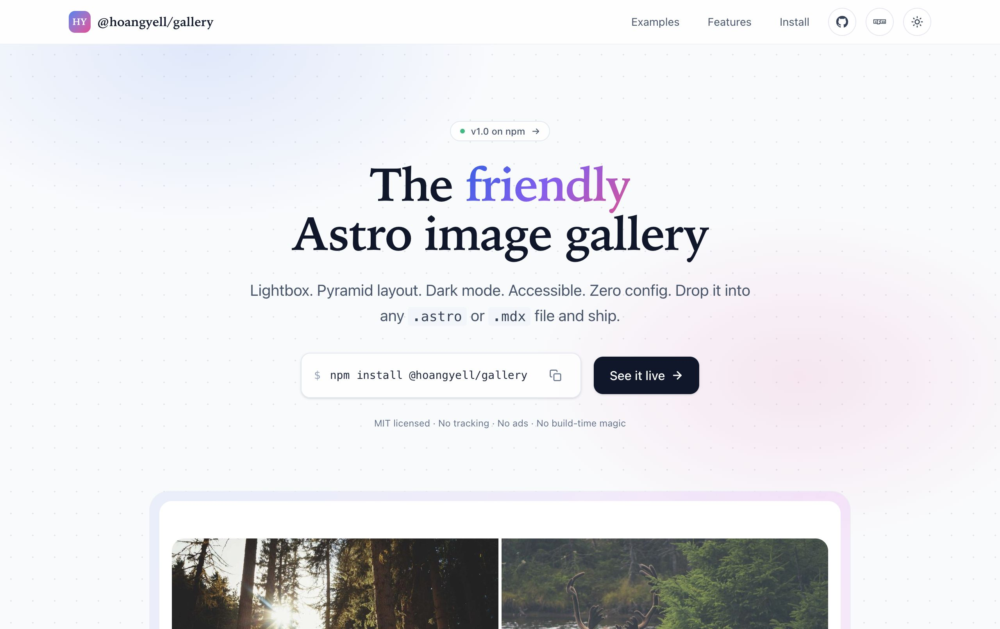
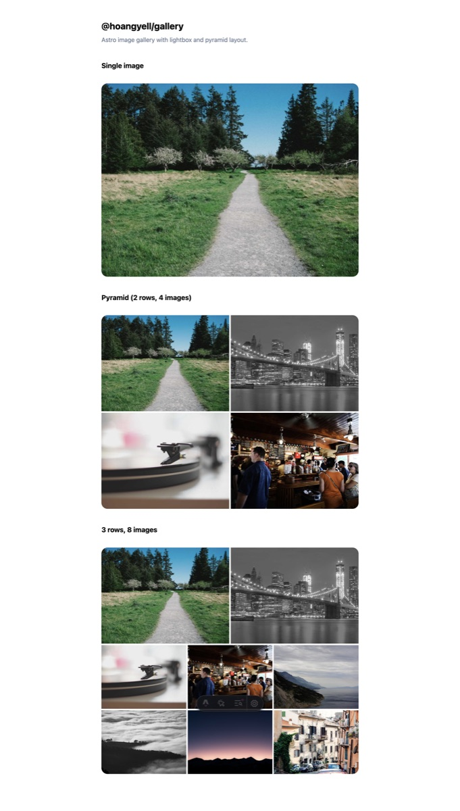
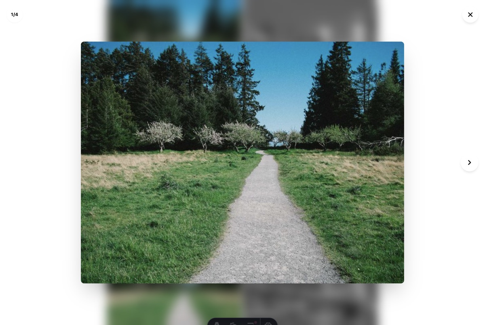

# @hoangyell/gallery

Astro image gallery with lightbox, pyramid multi-row layout, and accessible controls.

- Live demo: **[gallery.hoangyell.com](https://gallery.hoangyell.com)**
- npm: **[`@hoangyell/gallery`](https://www.npmjs.com/package/@hoangyell/gallery)**

<p align="center">
  <a href="https://gallery.hoangyell.com">
    
  </a>
</p>
<p align="center">
  
  
</p>

## Quick start

```sh
pnpm add @hoangyell/gallery
```

```astro
---
import { Gallery } from "@hoangyell/gallery";
---

<Gallery items={["/a.jpg", "/b.jpg", "/c.jpg"]} rows={2} />
```

## Development

```sh
pnpm install
pnpm dev                  # demo app at http://localhost:4325
pnpm build                # typecheck + build the demo to dist/
pnpm preview              # serve the built demo locally
pnpm typecheck            # typecheck every package
pnpm pack:check           # dry-run the npm tarball
```

## Deploy the demo site

The landing page at **[gallery.hoangyell.com](https://gallery.hoangyell.com)** is
the demo app in `examples/astro-basic/`, deployed to Cloudflare Pages
under the `Ngohoang.yell@gmail.com's Account`.

```sh
wrangler login            # one-time browser OAuth
pnpm deploy               # build + deploy to Cloudflare Pages
```

The deploy script verifies you're logged into the expected Cloudflare
account before doing anything, then runs `wrangler pages deploy` to the
`hoangyell-gallery` project. The custom domain `gallery.hoangyell.com`
is bound once via the Cloudflare dashboard.

## Release

Local end-to-end release using your `npm login` session. No CI, no
`NPM_TOKEN`, no GitHub secrets — just your terminal.

```sh
npm login                                  # one-time, uses browser OAuth

./scripts/release.sh                       # auto-bump patch (most common)
./scripts/release.sh minor                 # auto-bump minor
./scripts/release.sh major                 # auto-bump major
./scripts/release.sh 1.2.3                 # explicit version

# If your npm account has 2FA enabled for publish:
OTP=123456 ./scripts/release.sh
```

The script will:

1. Verify the working tree is clean, you're on `main`, you're logged into npm,
   the version is unused, and the tag doesn't exist.
2. Bump versions in `package.json` (root) and `packages/astro/package.json`.
3. Refresh `pnpm-lock.yaml` and typecheck the package.
4. Dry-run `npm publish` to catch permission errors **before** committing.
5. Commit + tag locally.
6. `npm publish` to the npm registry.
7. Push the commit and tag to GitHub.

If `npm publish` fails, the local commit and tag are rolled back automatically,
so you can fix the error and re-run with the same version number.

## License

MIT © [Hoang Yell](https://hoangyell.com)
